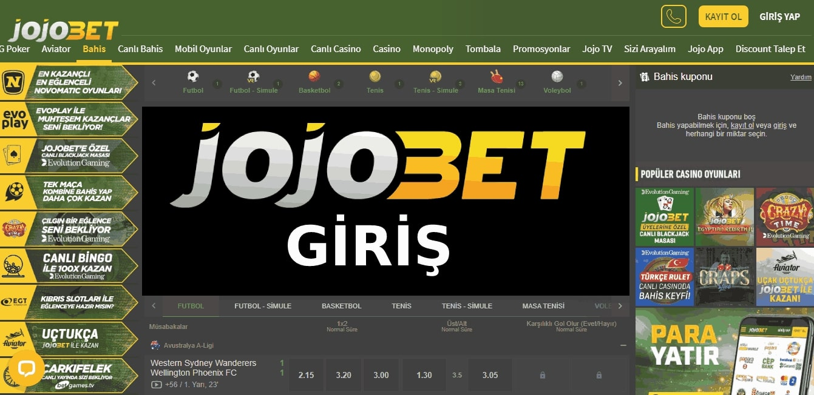

Jojobet868 | Jojobet 868 | Jojobet Giriş Adresi
===================================

   
Jojobet bahis firmasının pürüzsüz giriş domaini **jojobet868.com** halinde değişikliğe uğramıştır. Arama motoru yoluyla canlı casino şirketlerine direk ulaşım sağlama sıkıntısı karşı karşıya kalan casino oyuncuları bu anki canlı bağlantı adresi arzusuna gitmişlerdir. Biz de üstümüze düşen sorumluluğu uygulamak amacıyla ara vermeden Ülkemizde popüler olan  sanal bahis platformlarını filtreleyerek bitcoin ile oynayacaklara yardım edeceğiz. Sorgulanan Rexbet447, Baymavi835, Intobet218 ve Bovbet36 adres değişiklikleridir.

`DEVAM ETMEK İÇİN TIKLAYIN! <https://cutt.ly/QwVVg2Vk>`_
==============

.. list-table:: **BAHİS SİTELERİ YENİ ADRES DEĞİŞİKLİKLERİ**
   :widths: 100
   :header-rows: 1

   * - FİRMA
   * - `Pokerklas571 | Pokerklas 571 <pokerklas571-pokerklas-571-pokerklas-giris-adresi.html>`_
   * - `Bahisbeta512 | Bahisbeta 512 <bahisbeta512-bahisbeta-512-bahisbeta-giris-adresi.html>`_
   * - `Prensbet294 | Prensbet 294 <prensbet294-prensbet-294-prensbet-giris-adresi.html>`_	 
   * - `Bayşanslı522 | Bayşanslı 522 <baysansli522-baysansli-522-baysansli-giris-adresi.html>`_	 
   * - `Vegabet706 | Vegabet 706 <vegabet706-vegabet-706-vegabet-giris-adresi.html>`_ 
   * - `Wsbets461 | Wsbets 461 <wsbets461-wsbets-461-wsbets-giris-adresi.html>`_
   * - `581Favorisen | 581 Favorisen <581favorisen-581-favorisen-favorisen-giris-adresi.html>`_	 
   * - `Formenbet288 | Formenbet 288 <formenbet288-formenbet-288-formenbet-giris-adresi.html>`_
   * - `Modabet742 | Modabet 742 <modabet742-modabet-742-modabet-giris-adresi.html>`_
   * - `498Türkbet | 498 Türkbet <498turkbet-498-turkbet-turkbet-giris-adresi.html>`_
	 
Jojobet868 İstatistikleri:
===================================	 
* Adres değişikliği inceleme sayısı: 499
* Bigger Bass Oynayanlar: 3461
* Big Bass Oynayanlar: 1325
* Sweet Bonanza Oynayanlar: 1860
* Gate of Olympus Oynayanlar: 745
* Slot Oyunu Oynayanlar: 735
* Canlı Bahis Yapanlar: 3464
* Firmayı Beğenenlerin Yüzdelik Sayısı(%): %70
* Ortalama Kazanma Şansınız Yüzdelik Olarak(%): %46
* Günlük Ortalama Ziyaretçi Sayısı: 231
