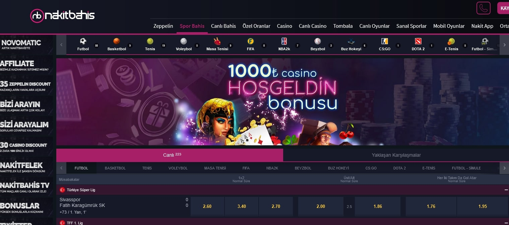

Nakitbahis844 | Nakitbahis 844 | Nakitbahis Giriş Adresi
===================================

   
Nakitbahis firmasının en doğru giriş adresi **nakitbahis844.com** olarak değişikliğe uğramıştır. İnternet üzerinden blackjack ofislerine bağlantı kurma sorunsalı ile karşılaşan slot oyuncuları tam da bu anki canlı giriş adresi hevesine bakmışlardır. Mesai arkadaşlarımızla bize düşen sorumluluğu uygulamak maksadıyla her an Büyük üne sahip  poker bürolarını analiz yaparak bitcoin ile oynayacaklara yardım edeceğiz. Kovuşturulan Klasbahis787, Monobahis412, 786Grandbetting ve Polobet860 adres değişiklikleridir.

`DEVAM ETMEK İÇİN TIKLAYIN! <https://cutt.ly/QwVVg2Vk>`_
==============

.. list-table:: **BAHİS SİTELERİ YENİ ADRES DEĞİŞİKLİKLERİ**
   :widths: 100
   :header-rows: 1

   * - FİRMA
   * - `Freybet507 | Freybet 507 <freybet507-freybet-507-freybet-giris-adresi.html>`_
   * - `Milbet329 | Milbet 329 <milbet329-milbet-329-milbet-giris-adresi.html>`_
   * - `Jetbahis620 | Jetbahis 620 <jetbahis620-jetbahis-620-jetbahis-giris-adresi.html>`_	 
   * - `Betroad200 | Betroad 200 <betroad200-betroad-200-betroad-giris-adresi.html>`_	 
   * - `Betkolik600 | Betkolik 600 <betkolik600-betkolik-600-betkolik-giris-adresi.html>`_ 
   * - `Vdcasino965 | Vdcasino 965 <vdcasino965-vdcasino-965-vdcasino-giris-adresi.html>`_
   * - `Dumanbet665 | Dumanbet 665 <dumanbet665-dumanbet-665-dumanbet-giris-adresi.html>`_	 
   * - `Milanobet772 | Milanobet 772 <milanobet772-milanobet-772-milanobet-giris-adresi.html>`_
   * - `Radissonbet149 | Radissonbet 149 <radissonbet149-radissonbet-149-radissonbet-giris-adresi.html>`_
   * - `Lavivabet571 | Lavivabet 571 <lavivabet571-lavivabet-571-lavivabet-giris-adresi.html>`_
	 
Nakitbahis844 İstatistikleri:
===================================	 
* Adres değişikliği inceleme sayısı: 260
* Bigger Bass Oynayanlar: 2001
* Big Bass Oynayanlar: 1153
* Sweet Bonanza Oynayanlar: 1050
* Gate of Olympus Oynayanlar: 1200
* Slot Oyunu Oynayanlar: 567
* Canlı Bahis Yapanlar: 2004
* Firmayı Beğenenlerin Yüzdelik Sayısı(%): %55
* Ortalama Kazanma Şansınız Yüzdelik Olarak(%): %11
* Günlük Ortalama Ziyaretçi Sayısı: 241
